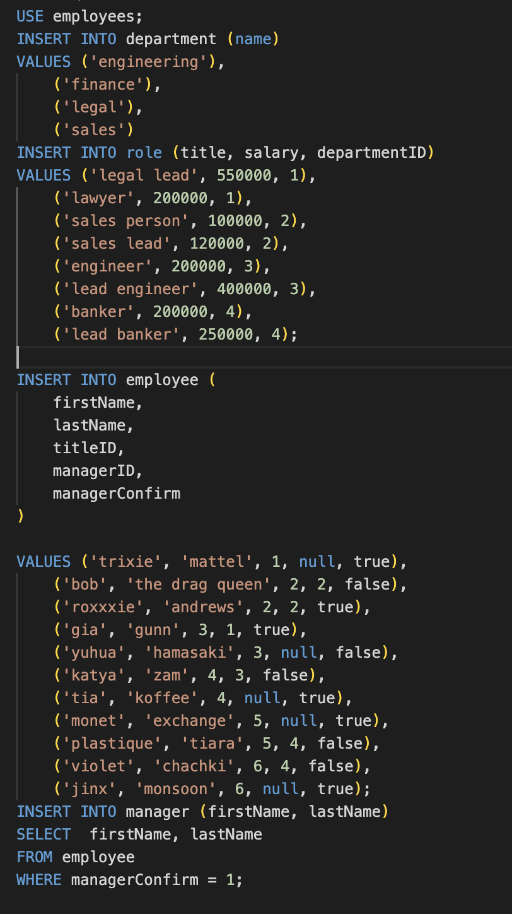

# SQL-EmployeeTracker

This application can create tables of employees, managers, salaries and roles. The user can also add employees, update employees, and search employees by manager
### License:
undefined
### Intallation:
to install the dependencies open the terminal and run:
NA
### Usage:
the project is used for managing and tracking employees in a company
### Contributors:
NA
### Questions:
Questions for future development: continue to debug the sql syntax
 ### Links
 [video](https://drive.google.com/file/d/1jq7ePgB8Re8Vd6ruGPIzygWFEURMnlGF/view)

 [github](https://github.com/mmontoya1112/SQL-EmployeeTracker)

### Screenshot of seeds
 